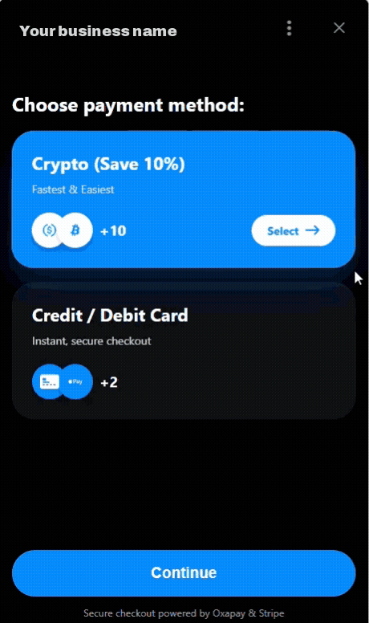
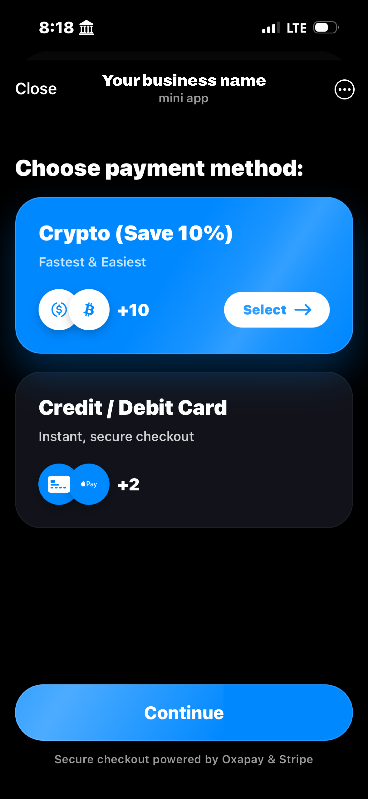
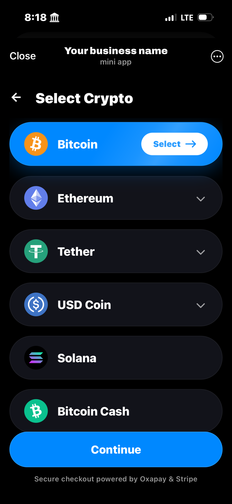
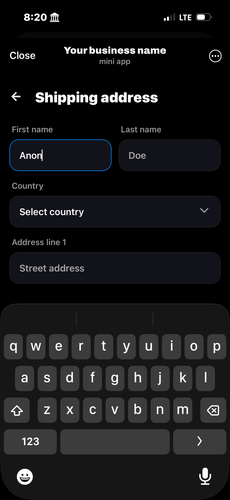
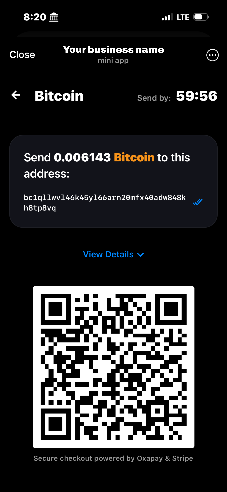

# Telegram Payment Web App

The ultimate payment flow for Telegram Mini Apps. A high-conversion, mobile-first e-commerce template built with React, Vite, and Tailwind CSS.

## Overview

This project provides a production-ready payment interface designed specifically for the Telegram Web App platform but can be deployed to websites as well. It seamlessly handles both traditional fiat payments (Stripe) and cryptocurrency transactions (Oxapay) within a responsive UI that feels native to Telegram.

**Key capabilities:**
- **Quick & Easy Checkout:** Optimized for Telegram's in-app browser environment.
- **Crypto and Traditional Payments:** Native support for Credit Cards/Apple Pay (Stripe) and Crypto (USDT, BTC, LTC, ETH via Oxapay).
- **Modular Architecture:** Clean React component structure for easy customization.
- **Security:** Built-in Telegram InitData verification to ensure requests come from within the official app.

## Features

### Payment Integration
- **Stripe Checkout:** Secure credit card processing with support for Apple Pay and Google Pay.
- **Oxapay Crypto:** Direct cryptocurrency payments with real-time exchange rates and QR code generation.
- **Real-time Invoices:** Automatic QR code generation and live status tracking via webhooks.

## Demo

| Landing Page                         | Select Crypto                       | Shipping Info                         | Payment Page                         |
| ------------------------------------ | ----------------------------------- | ------------------------------------- | ------------------------------------ |
|  |  |  |  |

### User Interface
- **Mobile-First Design:** 60fps smooth transitions and touch-optimized controls.
- **Smart Forms:** Intelligent input jumping and localized Zip Code validation.
- **Status Feedback:** Clear success/error states for payment confirmation.

### Backend & Persistence
- **Modular Architecture:** Separated backend (Fastify) and frontend (React + Vite) for easy portability.
- **SQLite Persistence:** Lightweight database for tracking orders and allowed chat sessions.

## Tech Stack

- **Frontend:** React 18, Vite, Tailwind CSS
- **Backend:** Node.js (Fastify) + SQLite
- **Gateways:** Stripe API, Oxapay API

## Custom Development & Integration

I build high-performance Telegram Mini Apps and automated payment systems. If you would like to integrate this solution into your bot or need custom development:

**Services:**
- Custom web apps inside Telegram
- Telegram bot customization
- AI-Powered Tools & Agents

**Contact:**
Please open an Issue or Discussion on this GitHub repository to inquire about licensing or custom integration.

---
*Note: This repository contains the frontend demonstration. The full backend implementation and source code are available for purchase and customization. Inquire above.*
